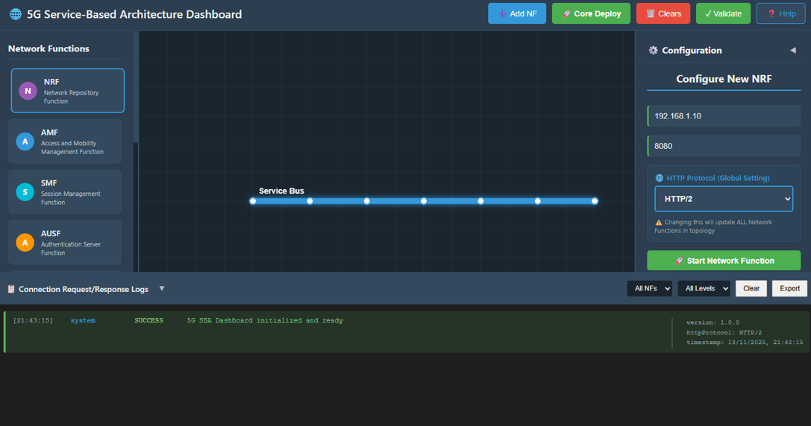
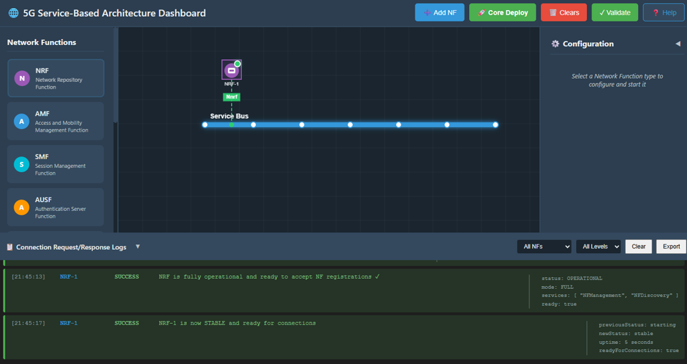
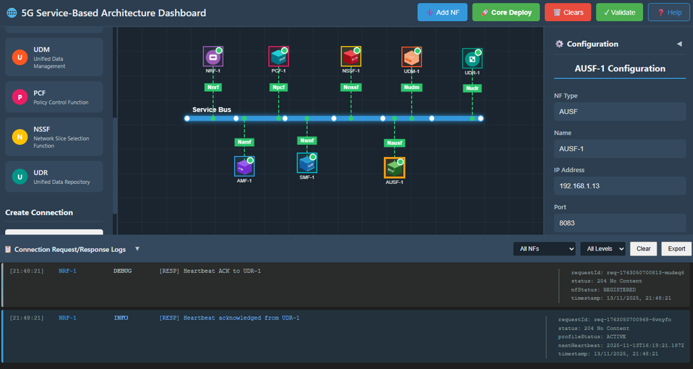
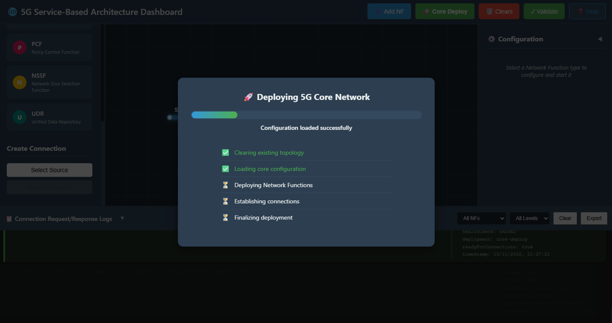
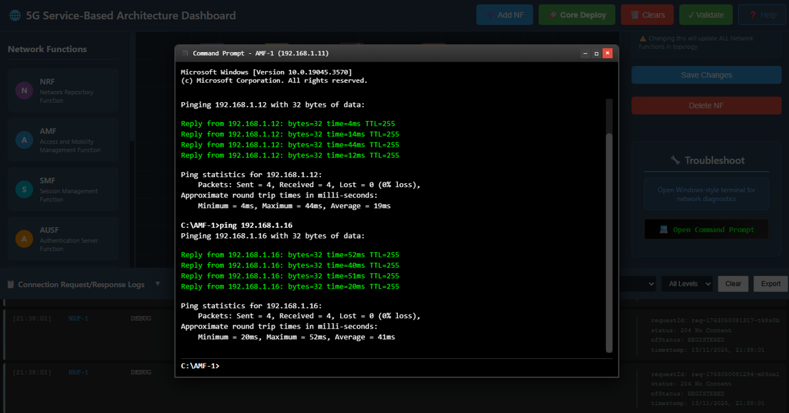

# Procedure: 5G Service-Based Architecture (SBA) Dashboard Deployment

## Step 1: Introduction to the 5G Service-Based Architecture (SBA) Dashboard

The 5G Service-Based Architecture Dashboard is a comprehensive platform designed to facilitate the deployment, configuration, and validation of core network functions (NFs) within a simulated 5G Core environment. This dashboard provides a user-friendly interface for managing complex network topologies and inter-NF communications.

The 5G Core can be deployed using either of the following approaches:

1. **Manual NF-by-NF Deployment** – Sequential initialization of network functions
2. **One-Click Core Deployment** – Automated simultaneous deployment of all network functions

Each method is described in detail in the following sections.

---

## Method 1: Manual NF-by-NF Deployment

### Step 2: Select and Configure a Network Function (NF)

#### 2.1 Selecting an NF

1. Navigate to the SBA Dashboard main interface.
2. Click on any NF tile corresponding to the desired network function (e.g., AMF, SMF, UPF, NRF, AUSF, UDM, PCF).



**Figure 1:** Select Network Function

#### 2.2 Entering Configuration Details

Upon selecting an NF, the NF Configuration Panel will be displayed. Enter the following required parameters:

- **IP Address:** Specify a valid IPv4 address (e.g., 192.168.1.12)
- **Port Number:** Provide the listening port for the NF (e.g., 8080, 9090)
- **Protocol:** Select the communication protocol from the dropdown menu:
  - HTTP/1
  - HTTP/2

#### 2.3 Starting the NF

1. Review the entered configuration parameters for accuracy.
2. Click the **Start NF** button to initiate the network function.

#### 2.4 Stabilization and Inter-NF Communication

The NF will undergo an initialization phase lasting approximately 4–5 seconds. During this time:

- The NF initializes its internal services and communication endpoints
- Upon successful initialization, the NF automatically attempts to establish communication with all available network functions
- The system registers the NF within the SBA topology



**Figure 2:** NF Start and Stabilization

### Step 3: Repeat the Process for All NFs

To establish a complete and operational 5G Core network:

1. Repeat Steps 2.1 through 2.4 for each network function in the required topology.
2. Ensure that each NF achieves the following state before proceeding to the next:
   - **Configured** – All parameters are correctly specified
   - **Started** – The NF has been successfully initiated
   - **Stabilized** – The NF has completed initialization and established inter-NF connections

Once all NFs have been successfully deployed and stabilized, the manual 5G Core setup becomes fully operational and interconnected.



**Figure 3:** Manually Started Core Network

---

## Method 2: One-Click Core Deployment

### Step 4: Initiate One-Click Core Deployment

One-Click Core Deployment automates the entire deployment process, eliminating the need for sequential NF configuration:

1. Locate and click the **Core Deploy** button on the main dashboard interface.
2. A fully automated deployment process will commence immediately.
3. The system will initialize all network functions and establish inter-NF communication automatically.

**Note:** Depending on the number of network functions in the topology, the complete initialization process may require several seconds to complete.

### Step 5: Understanding the Automated Deployment Steps

The One-Click Core Deployment process executes the following internal steps sequentially:

1. **Clearing Existing Topology**
   - Removes all previously running NFs
   - Resets the workspace to a clean state
   - Clears residual configurations and connections

2. **Loading Core Configuration**
   - Imports predefined NF settings and operational parameters
   - Initializes configuration templates for all NFs
   - Prepares the deployment environment

3. **Deploying Network Functions**
   - Automatically launches all required NFs according to the topology
   - Assigns IP addresses and port allocations
   - Initializes each NF's communication stack

4. **Establishing Internal Connections**
   - Configures SBA service interfaces between NFs
   - Establishes N1, N2, N3, N4, N6, N7, and N8 interfaces as required
   - Validates inter-NF connectivity

5. **Finalizing Deployment**
   - Performs comprehensive stability checks
   - Verifies all NF registrations
   - Completes the 5G Core initialization



**Figure 4:** One-Click Core Deployment

### Step 6: Verify Deployment Logs

Upon completion of deployment, verify the successful initialization by examining the Logs Panel:

1. Scroll to the **Logs Panel** at the bottom of the dashboard interface.
2. Observe system messages confirming successful deployment, such as:
   - "AMF started successfully"
   - "NRF registration completed"
   - "All NFs connected"
   - "Core deployment finalized"

These log messages provide confirmation that the automated deployment process has completed successfully and all network functions are operational.

---

## Troubleshooting & Validation

### Step 7: Test Connectivity Between NFs Using Ping

Network connectivity validation is essential to ensure proper inter-NF communication and core network functionality. The built-in ping utility allows verification of NF reachability.

#### 7.1 Opening the NF Terminal

1. Select the source network function from which you wish to conduct the connectivity test (e.g., AMF).
2. Scroll to the bottom of the NF Configuration Panel.
3. Click the **Open Command Prompt / Terminal** button to launch the NF terminal interface.

#### 7.2 Performing the Ping Test

1. In the terminal input field, enter the ping command with the target NF's IP address:
   ```
   ping <Target_NF_IP>
   ```

   **Example:**
   ```
   ping 192.168.1.21
   ```

2. Click the **Send** button to execute the ping command.



**Figure 5:** Ping Test to Check Connectivity Between Core Network Functions

#### 7.3 Analyzing Test Results

A successful connectivity test will display the following characteristics:

- **Continuous Reply Messages:** Each successful ping response displays "Reply from [IP Address]…" with response times
- **Zero Packet Loss:** All transmitted packets are successfully received (0% packet loss)
- **Stable Latency:** Response times remain consistent throughout the test

**Successful Test Confirmation:**

✓ Both NFs are active and responding  
✓ The network path between NFs is functioning correctly  
✓ Core network communication is stable and reliable

This confirms that the inter-NF communication is properly established and the 5G Core network is fully operational.

---
