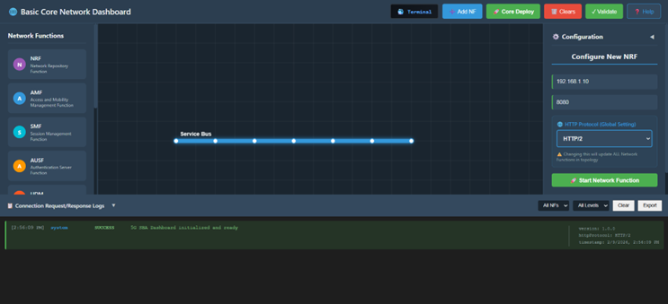
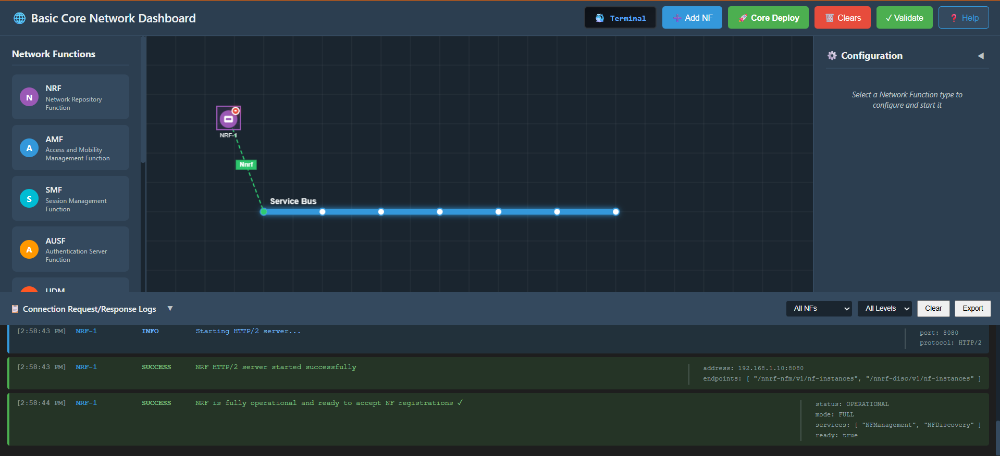
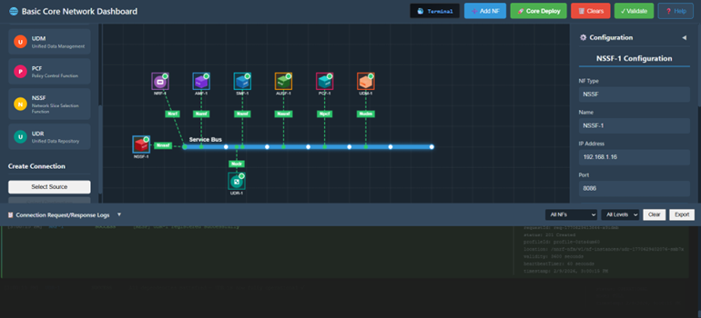
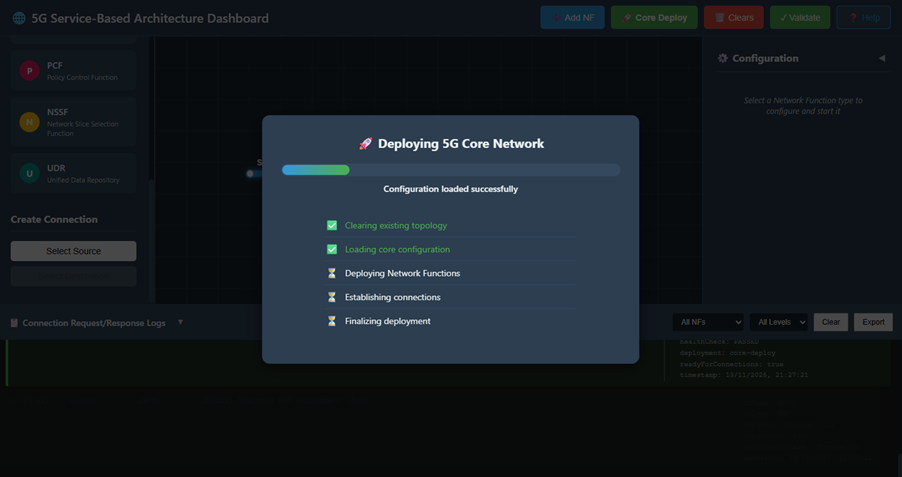
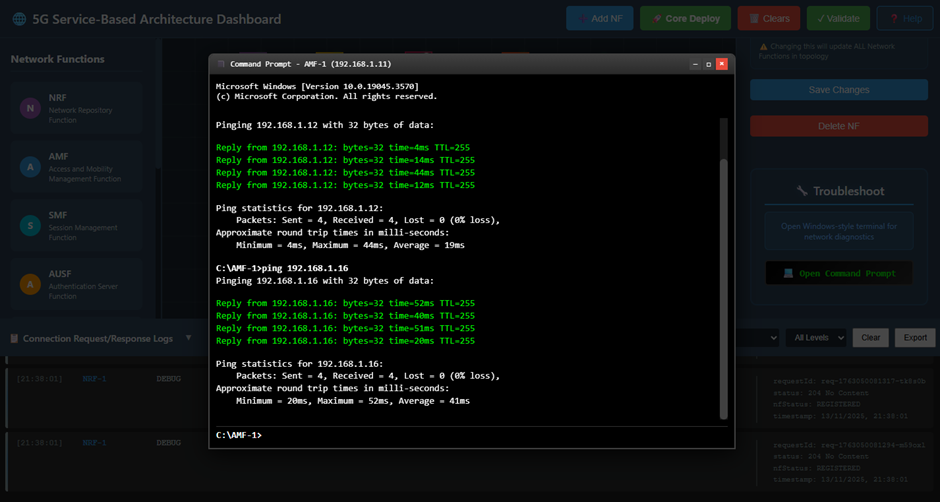

## Step 1: Introduction to the 5G Service-Based Architecture (SBA) Dashboard

The 5G Service-Based Architecture Dashboard allows you to deploy, configure, and validate core network functions (NFs) in a simulated 5G Core environment.

You can deploy the 5G Core using either of the following methods:

1. Deploy using Terminal
2. Manual NF-by-NF Deployment
3. One-Click Core Deployment

Each method is described in detail below.

---

## Method 1: Deploy Network Functions Using Terminal (Docker Compose)

This method allows you to deploy all Network Functions at once using predefined Docker Compose configurations.

### Step 2: Open the SBA Terminal

1. Launch the SBA Dashboard.
2. Click the **Terminal** button available in the dashboard interface.
3. Ensure you are in the project root directory.


### Step 3: Launch All Network Functions

Click on the terminal button to open the terminal then from the project root directory, execute the following command:

```bash
docker compose -f docker-compose.yml up -d
```


This confirms that all core NFs and supporting services are running successfully.

### Step 4: Verify Docker Network Creation

List available Docker networks:

```bash
docker network ls
```


You should see the oaiworkshop network:

```
NETWORK ID     NAME          DRIVER    SCOPE
5a7a4f1ebed2   oaiworkshop   bridge    local
```

### Step 4: Inspect Network and NF IP Assignment

Inspect the OAI network to verify IP allocation:

```bash
docker network inspect oaiworkshop
```


This confirms successful NF deployment and network stabilization.

### Step 5: Stop and Remove All Network Functions

To stop and clean up all running containers and networks:

```bash
docker compose -f docker-compose.yml down
```

---


## Method 2: Start NFs Manually (One by One)

### Step 6: Select and Configure a Network Function (NF)

1. **Select an NF:**
   - Click any NF tile (e.g., AMF, SMF, UPF, NRF, AUSF, UDM, PCF) on the dashboard.



2. **Enter Configuration Details:**
   - In the NF Configuration Panel:
     - **IP Address:** Enter a valid IPv4 address (e.g., 192.168.1.12).
     - **Port Number:** Provide the NF's port (e.g., 8080, 9090, etc.).
     - **Protocol:** Select the protocol from the dropdown: HTTP/1 or HTTP/2.

3. **Start NF:**
   - Click the **Start NF** button.

4. **Wait for Stabilization:**
   - The NF takes around 4–5 seconds to initialize and stabilize.
   - Once ready, it will automatically attempt to communicate with other available NFs.



### Step 7: Repeat the Process for All NFs

Follow Steps 6 for each NF in the topology.

Once all NFs are:
- Configured
- Started
- Stabilized

...your manual 5G core setup becomes active and interconnected.



---

## Method 3: One-Click Core Deployment

This method automatically deploys all Network Functions at once.

### Step 8: Initiate One-Click Core Deployment

1. Click the **Core Deploy** button.
2. A deployment process begins automatically.
3. The system may take some time to fully initialize depending on the number of NFs.

### Step 9: Understand the Automated Deployment Steps

The following steps are executed internally during one-click deployment:

1. **Clearing Existing Topology**
   - Removes previously running NFs and resets the workspace.

2. **Loading Core Configuration**
   - Imports predefined NF settings and parameters.

3. **Deploying Network Functions**
   - Automatically launches all required NFs.

4. **Establishing Internal Connections**
   - Ensures inter-NF communication using SBA interfaces.

5. **Finalizing Deployment**
   - Performs a stability check and completes the 5G Core initialization.



### Step 10: Verify Deployment Logs

Scroll to the Logs Panel to observe system messages such as:

- "AMF started successfully"
- "NRF registration completed"
- "All NFs connected"
- "Core deployment finalized"

These logs confirm successful automatic deployment.

---

## Troubleshooting & Validation

### Step 11: Test Connectivity Between NFs Using Ping

You can confirm whether NFs are reachable using the built-in ping terminal.

#### 1. Open the NF Terminal

1. Select the NF you want to test (e.g., AMF).
2. Scroll down the configuration panel.
3. Click **Open Command Prompt / Terminal**.

#### 2. Perform Ping Test

1. In the terminal input field, enter the command:
   ```bash
   ping <Target_NF_IP>
   ```

   **Example:**
   ```bash
   ping 192.168.1.21
   ```

2. Click **Send** to execute the ping.



#### 3. Analyze the Results

A successful test will show:

- Continuous reply messages (e.g., "Reply from 192.168.1.16…")
- 0% packet loss
- Stable latency

This confirms that:

✓ Both NFs are active  
✓ The network path is functioning  
✓ Core communication is stable
