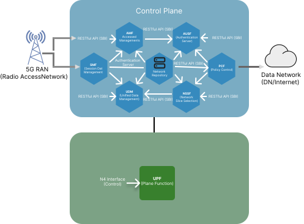
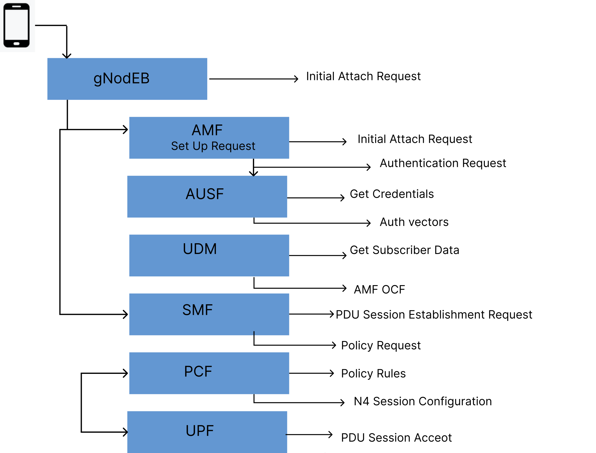
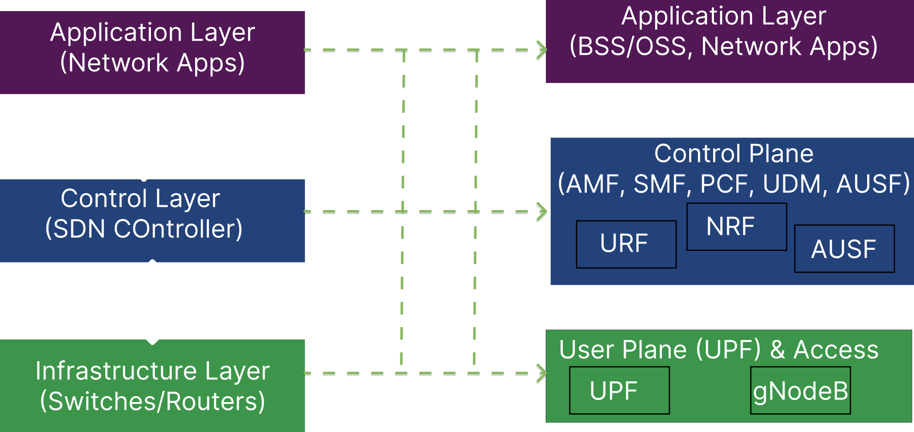
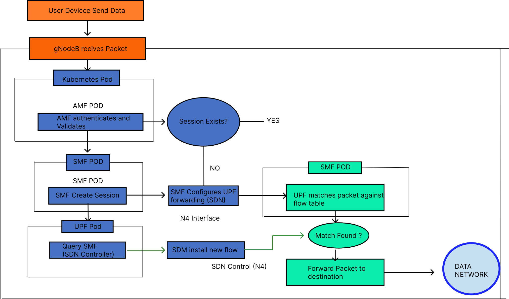
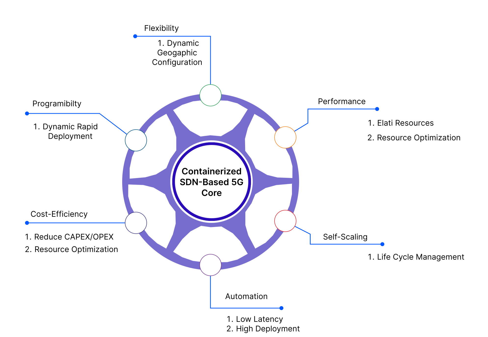

## 1. Introduction to the 5G Core Network (5GC)

The 5G Core Network (5GC) marks a significant evolution in mobile network architecture. It is designed to support a broad range of services — from enhanced mobile broadband (eMBB) to ultra-reliable low-latency communications (URLLC) and massive machine-type communications (mMTC). The 5GC adopts a Service-Based Architecture (SBA) in which network functions are implemented as modular, cloud-native services that interact via well-defined, standardized interfaces.

Cloud-native design principles (containerization, microservices, and orchestration) underpin the 5GC. These principles enable operators to deploy network functions as software instances that can scale dynamically, automate lifecycle operations, and improve resource utilization while reducing capital and operational expenditures.

As illustrated in **Figure 1**, the Service-Based Architecture (SBA) of the 5G Core Network highlights how various network functions communicate with each other through standardized, service-based interfaces.

*Fig 1: 5G Core Network Service-Based Architecture*

## 2. Key Components of the 5G Core

### 2.1 Control Plane Functions

<ol type="a"> <li><b>Access and Mobility Management Function (AMF)</b>: Single entry point for RAN control-plane traffic. The AMF handles registration, reachability, mobility management, and initial authentication/authorization flows for user equipment (UE).</li> <li><b>Session Management Function (SMF)</b>: Manages PDU sessions — session establishment, modification, and release. The SMF is responsible for IP address allocation, QoS handling, and steering traffic to appropriate User Plane Functions (UPFs).</li> </ol> 
<b>Other essential control plane functions include:</b>
 <ol type="a"> <li><b>Authentication Server Function (AUSF)</b>: Verifies subscriber credentials and manages authentication contexts.</li> <li><b>Unified Data Management (UDM)</b>: Provides subscriber profile, authentication data, and subscription information.</li> <li><b>Policy Control Function (PCF)</b>: Supplies policy rules for QoS, charging, and access control.</li> <li><b>Network Repository Function (NRF)</b>: Maintains a registry of available network function instances and their capabilities for service discovery.</li> <li><b>Network Exposure Function (NEF)</b>: Exposes selected network capabilities to third-party applications in a secure, controlled manner.</li> </ol>

### 2.2 User Plane Function (UPF)

The UPF implements the user/data plane for 5GC: high-performance packet forwarding, traffic inspection, QoS enforcement, and usage reporting. UPFs may be deployed centrally or at the network edge (MEC) to meet different latency and throughput requirements.

**Figure 2** depicts the step-by-step signaling flow required to establish a Protocol Data Unit (PDU) session. It demonstrates the critical interactions among the User Equipment (UE), the Control Plane functions, and the User Plane Function (UPF) during this establishment process.

*Fig 2: 5G Core Network: Session Establishment Flow*

## 3. Software-Defined Networking (SDN) Principles in 5GC

### 3.1 How SDN Concepts Map to 5GC

The 5GC embraces SDN principles by separating control and user planes and by exposing programmable interfaces to dynamically configure forwarding behavior. Key mappings:

<ol type="a"> <li><b>SDN Application Layer</b> ↔ OSS/BSS and network applications that request services and analytics from the core.</li> <li><b>SDN Control Layer (controller)</b> ↔ 5GC control-plane functions (AMF, SMF, PCF) that make global decisions and push policies.</li> <li><b>SDN Infrastructure Layer</b> ↔ UPF and RAN elements that execute forwarding rules and enforce QoS.</li> </ol>

The SMF closely resembles an SDN controller for the user plane: it maintains session state and programs UPF forwarding rules to realize traffic steering and QoS.

**Figure 3** demonstrates the conceptual mapping between traditional Software-Defined Networking (SDN) layers—namely the Application, Control, and Infrastructure layers—and their corresponding functional entities within the 5G Core Network.

*Fig 3: SDN Architecture Mapping to 5G Core Network*

## 4. Integration of SDN, 5GC, and Container Technologies

Modern 5GC deployments combine SDN principles with cloud-native technologies (Docker, Kubernetes) to achieve automated, scalable, and resilient networks.

### 4.1 Cloud-Native 5G

<ol type="a"> <li>Service-based communication uses HTTP/2 and REST/gRPC APIs between functions.</li> <li>Kubernetes provides service discovery, load balancing, rolling updates, and autoscaling (HPA) for network functions.</li> <li>Service meshes (e.g., Istio) add advanced traffic management, security, and observability.</li> </ol>

### 4.2 SDN-Enhanced Traffic Management for Containerized UPFs

<ol type="a"> <li>UPFs can be deployed as containerized services and configured programmatically by the SMF.</li> <li>CNIs and SDN controllers provide overlay/underlay connectivity, network policies, and integration with physical infrastructure.</li> </ol>

## 5. Benefits of a Containerized, SDN-Based 5G Core

### 5.1 Operational Benefits

<ol type="a"> <li>Rapid service rollout through automated deployments and APIs.</li> <li>Cost optimization via COTS hardware, improved resource utilization, and automation.</li> <li>Elastic scaling to match demand and geographic placement of UPFs for latency-sensitive services.</li> </ol>

### 5.2 Technical Benefits

<ol type="a"> <li><b>Programmability and flexibility:</b> network behavior is modified via software updates and API calls.</li> <li><b>Multi-vendor interoperability:</b> standardized interfaces and container packaging reduce vendor lock-in.</li> <li><b>Resilience:</b> Kubernetes self-healing, rolling updates, and distributed replicas improve availability.</li> </ol>

To further understand the practical implementation of these concepts, **Figure 4** outlines the detailed data path of a packet as it traverses from the Radio Access Network (RAN) through the containerized User Plane Function (UPF) within an SDN-enabled 5G environment.

*Fig 4: Packet Flow in a Containerized SDN-Based 5G Core Network*

## 6. Challenges and Considerations

### 6.1 Performance Considerations

<ol type="a"> <li>Container networking may add overhead; high-performance user plane workloads often require acceleration (SR-IOV, DPDK) or kernel bypass techniques.</li> <li>Proper CPU, memory, and NIC resource allocation and tuned CNI choices are essential for predictable performance.</li> </ol>

### 6.2 Operational and Security Challenges

<ol type="a"> <li><b>Operational complexity:</b> teams must adopt Kubernetes, observability tooling, and cloud-native practices.</li> <li><b>State management:</b> use StatefulSets or external data stores where persistent state is required.</li> <li><b>Security:</b> secure images, runtime protections, network policies, and robust API authentication/authorization are required.</li> </ol>

As a final overview, **Figure 5** summarizes the key operational and technical advantages of deploying a 5G Core Network using containerization and SDN principles, emphasizing benefits such as enhanced scalability, flexibility, and cost-efficiency.

*Fig 5: Benefits of a Containerized SDN-Based 5G Core Network*

## 7. Conclusion

Combining SDN principles with a cloud-native 5G Core—deployed as containerized microservices and orchestrated with Kubernetes—delivers a flexible, programmable, and efficient platform for next-generation services. The approach enables rapid service innovation, improved resource efficiency, and fine-grained traffic control, while placing new demands on performance engineering, operations, and security practices.

This experiment’s theory provides a practical foundation for exploring how SDN, container orchestration, and 5GC functions interact in real-world deployments.

